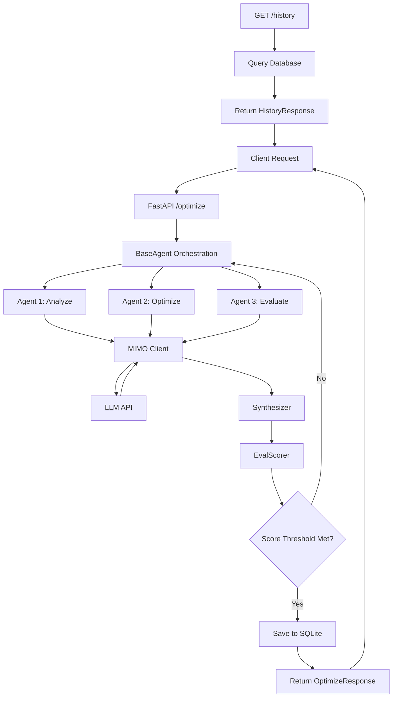

# PromptForge Architecture

PromptForge is a prompt optimization system that uses multiple AI agents to iteratively refine prompts based on evaluation criteria. It provides a FastAPI backend for submitting prompts, running multi-agent optimization cycles, and retrieving optimization history.

## Tech Stack

| Component | Technology | Purpose |
|-----------|-----------|---------|
| Language | Python 3.x | Core application logic |
| Web Framework | FastAPI | REST API endpoints |
| AI Integration | MIMO API | LLM inference for agents |
| Database | SQLite | Optimization history persistence |
| Frontend | JavaScript/HTML | Static web interface |

## Directory Structure

```
promptforge/
├── agents/          # Agent implementations (optimizer, evaluator, etc.)
├── api/             # FastAPI routes and request/response models
├── core/            # Core logic (agent base, synthesizer, MIMO client)
├── db/              # Database connection and CRUD operations
├── eval/            # Evaluation scoring system
├── public/          # Static frontend assets
├── .env.example     # Environment configuration template
├── requirements.txt # Python dependencies
└── README.md        # Project documentation
```

## System Flow



## Key Design Decisions

- **Multi-agent architecture**: Separates concerns into specialized agents (analysis, optimization, evaluation) that collaborate through a synthesis layer, enabling iterative refinement cycles.
- **Stateless API with persistent history**: FastAPI endpoints are stateless while SQLite provides durable storage for optimization runs, allowing clients to retrieve past results without session management.
- **Pluggable LLM backend**: MIMO client abstraction isolates LLM API calls, making it straightforward to swap providers or add fallback logic without touching agent code.
- **Score-driven iteration**: EvalScorer provides quantitative feedback that determines when optimization cycles terminate, ensuring output quality meets defined thresholds.
- **Synchronous execution model**: Agents run sequentially within a request cycle rather than async/queue-based, trading scalability for simpler debugging and deterministic behavior during development.